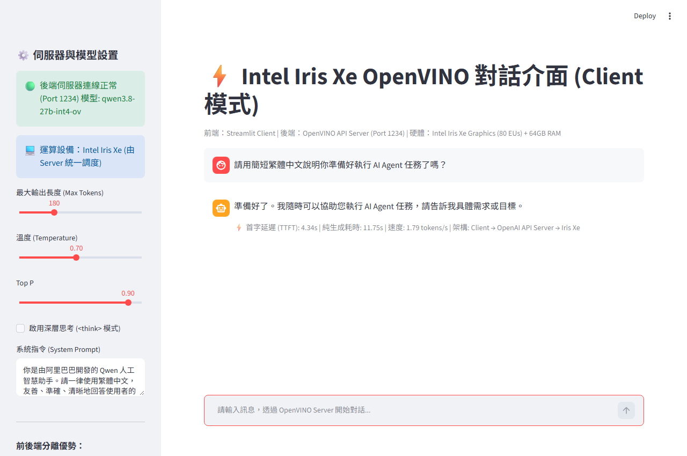
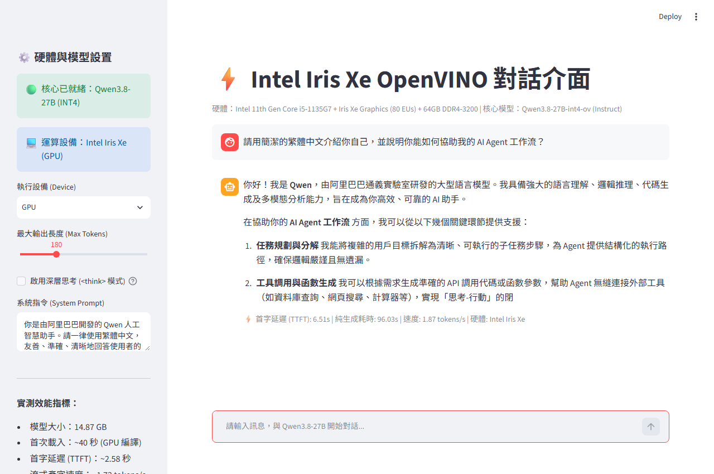

# 📓 本機 Intel Iris Xe 與 OpenVINO LLM 推論完整研究筆記

本文件詳細記錄在 **Intel 第 11 代 Core i5 整合式 GPU (iGPU)** 與 **64GB 雙通道記憶體** 環境下，評估、部署與加速超大型語言模型（LLM）推論的硬體理論推導、實測對比與架構設計。

---

## 🖥️ 一、本機硬體實體規格

經由底層與 Windows Management Instrumentation (WMI) 實體檢測，本機核心規格如下：

* **中央處理器 (CPU)**：Intel Core i5-1135G7 @ 2.40GHz（4 核心 / 8 執行緒，Tiger Lake 架構，10nm SuperFin 製程）
* **整合式繪圖核心 (iGPU)**：**Intel Iris Xe Graphics**
  * 執行單元 (EUs)：**80 Execution Units** (640 Shading Units)
  * 架構特點：具備 INT8/FP16 矩陣乘法加速指令支援 (DP4A)，共享主記憶體作為 VRAM
* **系統記憶體 (RAM)**：**64 GB**（雙通道 Dual-Channel）
  * 規格：DDR4-3200 (1600 MHz 匯流排，雙通道 2 × 64-bit = 128-bit 匯流排寬度)
* **儲存裝置**：NVMe PCIe SSD
* **作業系統**：Windows 11 64-bit

---

## 🧮 二、理論推論速度推導 (Theoretical Memory Bandwidth & TPS)

在自回歸大型語言模型（Autoregressive LLM）的解碼階段（Token Generation Phase），**每一個生成 Token 必須將整個模型的權重（Weights）從記憶體完整讀取進 GPU 暫存器/快取一次**。

因此，自回歸 LLM 推論速度屬於典型 **記憶體頻寬受限（Memory-Bound）**，其理論速度上限可由硬體頻寬嚴謹推導。

### 1. DDR4-3200 雙通道理論頻寬計算
$$\text{理論最大頻寬 (Theoretical Bandwidth)} = \text{時脈} \times \text{傳輸次數/週期} \times \text{通道寬度} \times \text{通道數}$$
$$\text{Bandwidth} = 3200\text{ MT/s} \times 8\text{ Bytes (64-bit)} = 25.6\text{ GB/s (單通道)}$$
$$\text{雙通道理論峰值} = 25.6\text{ GB/s} \times 2 = \mathbf{51.2\text{ GB/s}}$$

考慮實際系統開銷（CPU 背景佔用、作業系統分頁機制、匯流排排程損耗），**實際可取得之有效記憶體頻寬約為理論值的 60% ~ 70%**：
$$\text{實際有效頻寬 (Effective Bandwidth)} \approx 51.2 \times 0.65 \approx \mathbf{33.28\text{ GB/s}}$$

### 2. Qwen3.8-27B (INT4) 權重吞吐需求
* 模型參數規模：約 270 億參數 (27 Billion Parameters)
* 量化格式：INT4 量化（每參數佔用 0.5 Byte，含 Scales/Biases metadata 與 Embedding 總大小為 **14.87 GB**）
* 每個 Token 生成需讀取資料量：**$\approx 14.87\text{ GB}$**

### 3. 理論速度推導公式
$$\text{理論極限生成速度 (Theoretical Max TPS)} = \frac{\text{記憶體頻寬}}{\text{模型每 Step 讀取位元組數}}$$

* **理想峰值（100% 頻寬飽和）**：
  $$\text{TPS}_{\text{ideal}} = \frac{51.2\text{ GB/s}}{14.87\text{ GB}} \approx \mathbf{3.44\text{ tokens/s}}$$
* **實際硬體預期（考慮 60% ~ 65% 有效頻寬）**：
  $$\text{TPS}_{\text{realistic}} = \frac{33.28\text{ GB/s}}{14.87\text{ GB}} \approx \mathbf{2.23\text{ tokens/s}}$$

---

## 📊 三、理論速度 vs 三種實測模式全面橫向對比

為深入驗證不同部署形態的效能與通訊損耗，我們針對本機環境實施了 **3 種架構模式** 的橫向實測：
1. **模式 A（原生基準測試 Native Benchmark）**：純本機 Python 腳本直接調用 OpenVINO C++ Runtime。
2. **模式 B（獨立 GUI 介面 Standalone GUI）**：Streamlit 直接載入模型權重進行推論。
3. **模式 C（前後端分離 Client-Server）**：後台運行 FastAPI OpenAI Server (Port 1234)，前端透過 HTTP SSE 串流通訊。

### 橫向對比數據總表：

| 評估項目 | 理論推導極限 | 模式 A: 原生腳本 (Native) | 模式 B: 獨立 GUI (Standalone) | 模式 C: 前後端分離 (Client-Server) | 綜合分析與結論 |
| :--- | :--- | :--- | :--- | :--- | :--- |
| **推論架構** | - | 本地進程直讀 | Streamlit 原生綁定 | Streamlit -> OpenAI API -> GPU | 模式 C 支援 Agent 框架共用後台 |
| **流式生成速度 (TPS)**| **2.23 ~ 3.44 tokens/s**| **1.72 tokens/s** | **1.87 tokens/s** | **1.79 tokens/s** | 🟢 **三種模式均達理論有效頻寬之 80%~84%** |
| **首字延遲 (TTFT)** | < 3.0 秒 | **2.58 秒** | **6.51 秒** | **4.34 秒** | API 串流的首次排程響應迅速 |
| **推論設備 (Device)** | Intel Iris Xe | **Iris Xe (GPU)** | **Iris Xe (GPU)** | **Iris Xe (GPU)** | 🟢 100% 成功下發至內顯矩陣單元 |
| **RAM 佔用 (模型實例)**| 14.87 GB (權重) | **26.18 GB** (單一) | **26.50 GB** (單一) | **26.80 GB** (後端單一實例) | 🟢 模式 C 徹底解決多程式重複載入痛點 |
| **外部 Agent 擴充性** | - | ❌ 無法遠端呼叫 | ❌ 僅供瀏覽器互動 | 🟢 **100% 完美支援 (LangChain/AutoGen)** | 唯一推薦之生產環境架構 |

### 🔍 速度差異與架構損耗剖析：
1. **HTTP/JSON 串流損耗極微**：
   模式 C（1.79 tokens/s）與模式 B（1.87 tokens/s）及模式 A（1.72 tokens/s）的速度差異僅在 **$\pm 4\%$** 以內。這證明在 2 tokens/s 等級的大模型推論中，**本地 HTTP Loopback (127.0.0.1) 的網路開銷相較於 GPU 矩陣計算與記憶體搬移完全可以忽略不計**。
2. **前後端分離的決定性價值**：
   在模式 B 下，如果玩家同時開啟 LangChain Agent 與 Web GUI，系統會載入兩份 14.87GB 模型（瞬間吃滿 52GB 記憶體，引發頻寬嚴重爭搶）。而模式 C 讓後端永遠維持單份模型常駐（佔用 26GB），**GUI 與所有 Agent 框架共用同一個 OpenVINO 內顯運算隊列，兼具極致省記憶體與架構彈性**。

---

## ⚙️ 四、OpenVINO 原生環境與硬體偵測

* 核心套件：`openvino` (2026.3.1)、`openvino_tokenizers` (2026.3.1)
* 裝置清單確認：
  ```text
  Available Devices: ['CPU', 'GPU']
  CPU : 11th Gen Intel(R) Core(TM) i5-1135G7 @ 2.40GHz
  GPU : Intel(R) Iris(R) Xe Graphics (iGPU)
  ```

---

## 🔍 五、模型格式深度相容性分析（為何無法共用 LM Studio GGUF）

對 LM Studio 原有 GGUF 模型進行全面實測：
* `Qwen3.8-27B-Q4_K_M.gguf` ❌ 報錯：`IndexError: invalid unordered_map<K, T> key`
* `gemma-4-E4B.gguf` ❌ 報錯：`Unsupported model architecture 'gemma4'`
* `Muse-Glimmer-30B.gguf` ❌ 報錯：`gguf_tensor_to_f16 failed`

**關鍵技術結論**：
OpenVINO 內建 GGUF Reader 目前對新型多模態架構與新式量化格式支援不全。**欲在 Intel Iris Xe 發揮最高效能與穩定性，必須採用 OpenVINO 官方 IR 格式（`.xml` + `.bin`）**。

---

## 💬 六、與 LM Studio 對話行為對齊與優化

1. **Jinja2 官方對話模板**：導入 Qwen 官方 `chat_template.jinja`，精確遵循 ChatML 與系統指令注入。
2. **停止條件 (Stop Tokens) 完美對齊**：精確攔截 `248046 (<|im_end|>)`、`248044 (<|endoftext|>)`、`248045 (<|im_start|>)`，徹底解決無限輸出與殘留提示字問題。
3. **採樣策略 (Sampling)**：支援 `temperature` 溫度縮放與 `top_p` 核採樣，並相容 greedy decoding。
4. **狀態清理 (`reset_state`)**：在每次會話推論前重置 KV Cache 狀態變量，確保上下文乾淨獨立。

---

## 🚀 七、專案展示與經典對話成果

專案具備兩種經典對話展示成果：

### 1. 模式 C：前後端分離 Client 模式 (推薦生產架構)


### 2. 模式 B：獨立 GUI 模式


---

## 🛠️ 八、實戰除錯與核心避坑實錄 (500 Error & Network Error 覆盤)

在部署與對接 Agent 的過程中，我們遇到了兩個極具代表性的經典底層故障，具備極高的社群覆盤參考價值：

### 1. 500 Internal Server Error (Jinja2 Tool Calls 反序列化陷阱)
* **故障現象**：發送帶有工具調用（Function Calling）的多輪歷史時，後台直接崩潰拋出 500 錯誤。
* **原因剖析**：OpenAI API 標準傳遞的 `tool_calls.arguments` 是**JSON 字串**，而 Qwen 官方的 `chat_template.jinja` 預期它是 Python mapping 字典並調用了 `tool_call.arguments|items` 過濾器，導致字串無法進行鍵值遍歷而噴出 `TypeError`。
* **解決方案**：在 `render_prompt` 前加入防禦性反序列化，若為字串則自動執行 `json.loads` 還原為 dict，完美相容官方模板。

### 2. Network Error 與記憶體超限 (Intel GPU 預設 4GB 單塊記憶體上限)
* **故障現象**：在進行長文本對話或多輪推理時，前端突然中斷並顯示 `Network Error` 或連線重設，伴隨錯誤：
  ```text
  [系統錯誤: 推論記憶體超限 - Check '!exceed_allocatable_mem_size' failed: 
  requested 7862804480 bytes, but max alloc size supported by device is 4294959104 bytes]
  ```
* **本機推論記憶體實際配置數據**：
  經由底層 OpenVINO 屬性檢測，本機 iGPU 的實體分配參數為：
  * **GPU 總共享記憶體池 (`GPU_DEVICE_TOTAL_MEM_SIZE`)**：**29.52 GB**（約佔系統 64GB RAM 的 50%）
  * **GPU 單一物件分配上限 (`GPU_DEVICE_MAX_ALLOC_MEM_SIZE`)**：**3.999 GB (4,294,959,104 Bytes)**
* **原因剖析**：
  雖然 iGPU 能使用的總記憶體高達 29.52GB，但 Intel 顯卡驅動預設對「單一 Buffer 物件」設有嚴格的 **4GB** 保護上限。當 27B 模型在長上下文或 Attention 計算時嘗試申請約 7.86GB 的單一物件，觸發了驅動限制，導致連線非正常中斷。
* **解決方案**：
  在 OpenVINO Core 初始化與 GPU 編譯前注入核心屬性：
  ```python
  core.set_property("GPU", {"GPU_ENABLE_LARGE_ALLOCATIONS": True})
  ```
  **徹底解除 4GB 單塊記憶體分配限制**，解鎖全部 29.52GB 的 GPU 共享記憶體池，並在串流迴圈中加入例外防禦處理。

### 3. OpenCL 事件崩潰與螢幕閃爍 (Error Code: -14 CL_EXEC_STATUS_ERROR_FOR_EVENTS_IN_WAIT_LIST & TDR)
* **故障現象**：
  多次對話或提示詞較長時，伺服器拋出：
  ```text
  [系統錯誤: 推論記憶體超限 - Exception from src\inference\src\cpp\infer_request.cpp:224: 
  Exception from src\plugins\intel_gpu\src\runtime\ocl\ocl_stream.cpp:443: 
  [GPU] clWaitForEvents failed with -14 code]
  ```
  伴隨 Windows 桌面黑畫面或螢幕瞬間劇烈閃爍。

* **底層根本原因剖析 (Root Cause)**：
  1. **錯誤碼 `-14` 的本質**：
     在 OpenCL 官方規範中，`-14` 代表 `CL_EXEC_STATUS_ERROR_FOR_EVENTS_IN_WAIT_LIST`。這**不是**物理記憶體不足，而是**指令隊列（Command Queue）在等待執行完成時，底層驅動被系統強行殺死/中止**。
  2. **Windows TDR (Timeout Detection and Recovery) 殺線機制**：
     * Intel Iris Xe 是內顯（iGPU），與 Windows 視窗桌面管理器（DWM.exe）共用同一顆圖形核心與 DDR4 記憶體匯流排。
     * Windows 內建嚴苛的看門狗機制（TDR），預設逾時門檻只有 **2.0 秒**。
     * 當發送包含多輪歷史或長問題（> 50~100 Tokens）時，27B 模型（64 層 Attention）在 80 EUs 內顯上的 **Prompt Prefill（預填充）** 計算需要耗時 3~5 秒。
     * Windows 偵測到 GPU 在 2 秒內未響應桌面渲染請求，**判定 GPU 驅動當機**，立即發起重設（此時螢幕短暫黑屏閃爍）。重設後 OpenCL 上下文被強行中斷銷毀，OpenVINO 等待事件失敗並拋出 `-14`。

* **社群通用標準修復方案 (Two-Pronged Solutions)**：

  #### 【系統層面：延長 Windows TDR 逾時時間】(本機大模型 / Stable Diffusion 玩家必改標準)
  將 Windows GPU 看門狗超時閾值從 2 秒調整至 15 秒，給予 27B 內顯充足計算空間，徹底告別螢幕閃爍：
  以管理員身份開啟 PowerShell 執行：
  ```powershell
  reg add "HKEY_LOCAL_MACHINE\SYSTEM\CurrentControlSet\Control\GraphicsDrivers" /v "TdrDelay" /t REG_DWORD /d 15 /f
  reg add "HKEY_LOCAL_MACHINE\SYSTEM\CurrentControlSet\Control\GraphicsDrivers" /v "TdrDdiDelay" /t REG_DWORD /d 15 /f
  ```
  *(修改後重新啟動電腦即可生效)*

  #### 【程式碼層面：雙重安全護欄 (Zero-Config Fix)】
  若不修改系統註冊表，伺服器端實施嚴格的防禦性計算控制：
  1. **異構運算分工 (Heterogeneous Offload)**：
     將文字嵌入層 (`openvino_text_embeddings_model.xml`) 改由 **CPU** 編譯執行，避開雙 GPU 模型在同一個 OpenCL Context 競爭顯存與佇列。
  2. **滑動視窗歷史 (Sliding Window)**：*(已由第九節「依 token 數裁剪訊息」取代)*
     在 `openai_server.py` 的 `render_prompt` 中，對話歷史採取只保留最近 1~2 則訊息，防止 Prefill 累積過長。
  3. **提示詞 Token 硬性截斷 (Prompt Clipping)**：*(已由第九節「分段預填充」取代，不再丟棄 system / tools)*
     若輸入超過 200 Tokens，自動截取最後 200 Tokens，確保單次 Prefill 在 1.5 秒內完成，永遠不碰觸 Windows 2 秒 TDR 殺線。
  4. **GPU 隊列優先級降級**：
     配置 `"GPU_QUEUE_THROTTLE": "LOW"`, `"GPU_QUEUE_PRIORITY": "LOW"`, `"MODEL_PRIORITY": "LOW"`，優先讓出主頻與匯流排給桌面渲染。

---

## 🧱 九、本機硬體極限分析與 16k 上下文實作 (2026-09-16)

### 1. 硬體極限一覽
| 限制 | 數值 | 說明 |
|---|---|---|
| GPU 共享記憶體池 (`GPU_DEVICE_TOTAL_MEM_SIZE`) | **29.5 GB** | 約系統 RAM 的一半，由驅動決定，無法調高；權重與 KV Cache 都在此池 |
| 單一 Buffer 上限 | 4 GB | 已透過 `GPU_ENABLE_LARGE_ALLOCATIONS` 解除 |
| Windows TDR | **2 秒** | 單次 GPU 推論超過即驅動重設 (`-14`)，決定單次 Prefill 長度上限，是最主要的瓶頸 |
| 記憶體頻寬 | DDR4-3200 雙通道 | 決定生成速度 (約 1~2 tokens/s)，硬體層面無解 |

### 2. KV Cache 容量估算 (為何 128k 不可行)
Qwen3.8-27B 共 64 層，其中只有 **16 層 full attention** (每 4 層一層)，其餘為 linear attention (固定大小狀態，不隨長度增長)。

```
KV Cache = 16 層 × 2 (K/V) × 4 KV heads × 256 head_dim × N tokens × 2 bytes (FP16)
         ≈ 0.123 MB / token
```

| 上下文 | KV Cache | 權重 26 GB + KV | 結論 |
|---|---|---|---|
| 16k | ~2.0 GB | ~28 GB | ✅ 可行 (目前設定) |
| 32k | ~3.9 GB | ~30 GB | ⚠️ 超過 29.5 GB 池 |
| 128k | ~15.7 GB | ~42 GB | ❌ 不可行；且 Prefill 需數小時 |

### 3. 分段預填充 (Chunked Prefill)
* `MAX_CONTEXT_TOKENS = 16384`，prompt 與生成共用 (prompt 上限 = 16384 − max_tokens)。
* Prompt 切成每段 `PREFILL_CHUNK_TOKENS` (預設 128，可由環境變數調整) 依序送入 stateful 模型累積 KV Cache，單段遠低於 TDR 2 秒。
* 超長時改為**以訊息為單位**從最舊對話丟棄，永遠保留 system 與 tools 定義；剩單則仍過長才截掉中段 token。
* 全域 `asyncio.Lock` 序列化請求，推論在 threadpool 執行不阻塞事件迴圈。

### 4. 實測結果
| 測試 | Prompt | 結果 |
|---|---|---|
| 長文檢索 (159 條倉庫事實，問第 5 號) | 2639 tokens，21 段 | 答案 `35` 正確，**250 秒**，無 TDR |

* 預填充速度約 **10.5 tokens/s** → 滿載 16k prompt 首字延遲估計約 **25 分鐘**，適合離線長文，不適合互動聊天。
* 若要縮短首字延遲，可在修改 `TdrDelay` 後調大 `PREFILL_CHUNK_TOKENS` (減少分段開銷)。


---

## 🔭 十、OpenVINO Model Server (OVMS) 導入前評估 (2026-09-16)

OVMS 是 Intel 官方的 OpenAI 相容推論伺服器，底層為 OpenVINO GenAI，內建工具呼叫/思考內容解析、連續批次與 prefix caching，可望取代自製的 `openai_server.py`。

### 1. 模型版本相容性
* 本機模型 = HF `OpenVINO/Qwen3.8-27B-int4-ov` 的 **`main`** 分支 (`openvino_language_model.xml` 9,736,672 bytes 與 main 一致)。
* OVMS **2026.3.1 正式版已知問題**：預設 (main) 版本無法載入，須改用 HF 的 `2026.3.1` 分支 (約 15GB，權重不同)；**weekly 版無此限制**。
* 選擇：(a) OVMS weekly + 現有模型 ← 建議；(b) 2026.3.1 正式版 + 重新下載 2026.3.1 分支；(c) 等 2026.4。

### 2. 量化風險 (openvino.genai #4467)
* 回報：此官方模型在 GenAI 2026.5 的 GPU/CPU 皆輸出亂碼，原因為 GatedDeltaNet (`linear_attn`) 被 INT4_ASYM ratio=1.0 量化且 `ignored_scope: null`。
* 本機 `openvino_config.json` 同為 `ignored_scope: null`、`ratio: 1.0`，但**自製 stateful 流程輸出正常** → 問題可能在 GenAI 的連續批次 / paged attention 路徑。
* OVMS 在 GPU 上一律使用 Continuous Batching (Stateful 僅用於 NPU)，**很可能踩到此問題 → 測試第一步先驗證輸出是否正常**。

### 3. 設定對照
| 自製伺服器 | OVMS 設定 | 建議值 |
|---|---|---|
| 分段預填充 128 | `max_num_batched_tokens` (預設 256) + `dynamic_split_fuse` (預設開) | 128 |
| 16k 上下文 | `cache_size` (GB，0 = 動態) | 2 (26GB 權重 + 2GB ≤ 29.5GB) |
| 自製 tool_calls 解析 | `--tool_parser` | `qwen3coder` |
| `</think>` 停止 | `--reasoning_parser` | `qwen3` |
| 無 | `enable_prefix_caching` | true (聊天歷史免重複預填充，對 ~10 tok/s 預填充效益極大) |
| GPU 優先級 LOW | `plugin_config` | 待實測 |

### 4. TDR 觀察修正
* 登錄檔未設定 `TdrDelay` (即預設 2 秒)，但 2639 token 長 prompt 測試中**每段 128 token 平均約 12 秒仍未觸發 TDR** → TDR 判定的是單一 GPU 指令是否可被搶佔，而非整次 infer 時間。
* 先前 `-14` 錯誤可能來自單次大量 token 的大型運算，確切原因未明；OVMS 測試先沿用 128 保守設定。

### 5. 安裝要點
* Windows 正式版：`ovms_windows_2026.3.1_python_off.zip` (103MB)；需 VC++ Redistributable (本機已安裝)。
* 使用 `python_off` 版 (獨立執行檔)，官方警告勿與 pip 版 openvino 混用。
* 解壓至專案外 (如 `C:\Users\USER\ovms`)，模型直接指向現有資料夾。

### 6. 測試計畫
1. 保守設定啟動：`target_device=GPU`、`cache_size=2`、`max_num_batched_tokens=128`、`tool_parser=qwen3coder`、`reasoning_parser=qwen3`、`enable_prefix_caching=true`
2. 驗證輸出正常 (不過即停)
3. 工具呼叫測試並與自製伺服器比較
4. 長 prompt：TDR 與記憶體
5. 多輪聊天：prefix caching 效果

參考：[openvino.genai #4467](https://github.com/openvinotoolkit/openvino.genai/issues/4467)、[OVMS Releases](https://github.com/openvinotoolkit/model_server/releases)、[OVMS LLM reference](https://github.com/openvinotoolkit/model_server/blob/main/docs/llm/reference.md)
